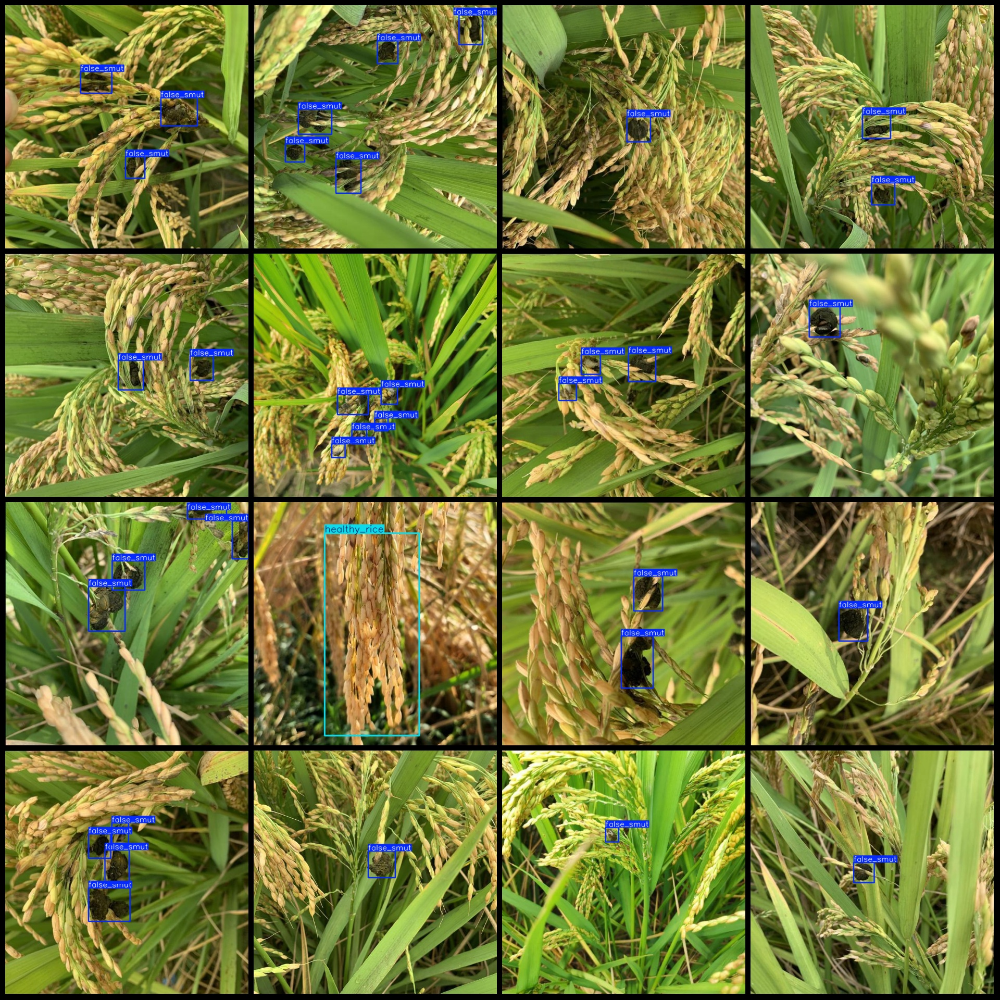
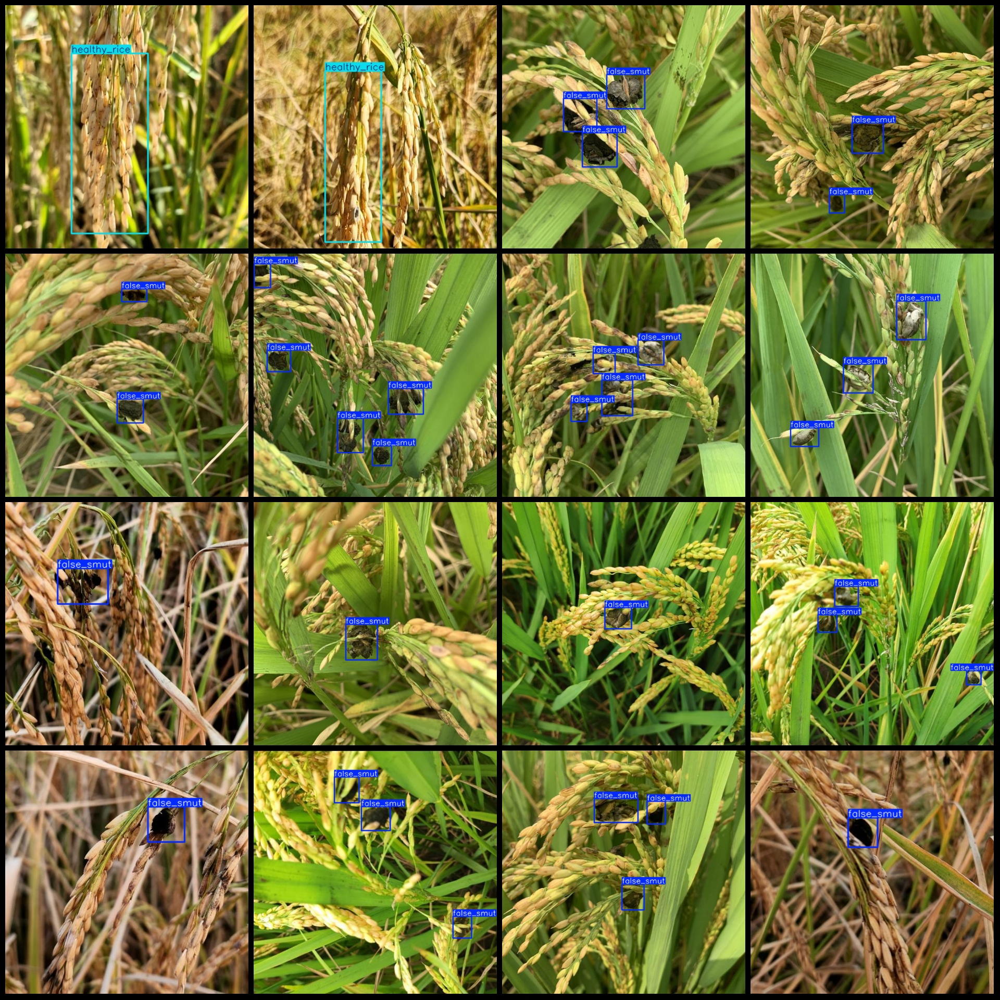

# Wisdom Agriculture Rice Blast Disease Detection Dataset VOC+YOLO Format with 357 Images and 3 Categories

Note: Approximately 150 images are original, the remaining are enhanced images, mainly rotation enhancement.

Dataset format: Pascal VOC format + YOLO format (txt file without split path, only containing jpg images and corresponding VOC format xml files and yolo format txt files).

Number of images (jpg file count): 357
Number of annotations (xml file count): 357
Number of annotations (txt file count): 357
Number of annotation categories: 3
Annotation category names: ["brown_spot", "false_smut", "healthy_rice"]

Each category annotations:
- brown_spot (brown spot disease) = 9
- false_smut (rice blast) = 758
- healthy_rice (healthy rice) = 34

Total number of boxes: 801

Each category occupied images:
- brown_spot (brown spot disease) = 3
- false_smut (rice blast) = 327
- healthy_rice (healthy rice) = 31

Image resolution: 640x640

Annotation tool used: labelImg
Annotation rules: draw a box around the category

Important notice: The dataset does not have been divided into training, validation, or testing sets; please divide them yourself.

Special statement: This dataset does not guarantee the accuracy of the trained model or weight files.

Image preview:
Annotation example:

## Images

Here is a pay link on Stripe ( https://buy.stripe.com/3cs8yP7sY87d0vu9AB ). Please contact me lonlonago@foxmail.com after funding $89, and I will send you a complete data files , thank you!

